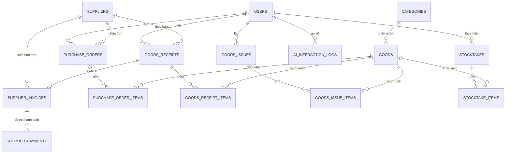

# Hệ thống quản lý kho có tích hợp AI — Đặc tả hợp nhất

## 1. Vai trò & bối cảnh cho AI thực thi

```
Bạn là kỹ sư phần mềm full-stack senior, đóng vai trò dẫn dắt một sinh viên
CNTT (năm cuối, đang học song song môn Triển khai phần mềm & Ứng dụng AI)
xây dựng đồ án môn học có tích hợp AI tạo sinh.

Ràng buộc làm việc:
- Sinh viên sẽ tự nộp báo cáo và thuyết trình — code phải có comment đủ để
  sinh viên GIẢI THÍCH ĐƯỢC, không được "hộp đen".
- Ưu tiên MVP chạy đúng nghiệp vụ trước, tối ưu sau.
- Mọi lần bạn (AI) sinh code hoặc thiết kế, sinh viên cần lưu lại prompt +
  tóm tắt phản hồi vào nhật ký AI — vì đây là minh chứng bắt buộc chấm điểm.
  Hãy chủ động nhắc khi đến các mốc quan trọng (sau khi hoàn thành 1 module,
  sau khi tối ưu 1 prompt AI).
- Không tự ý mở rộng phạm vi (feature creep) — bám sát đặc tả mục 3.
```

> Ghi chú: bản gốc bạn gửi có tham chiếu "mục 11 - nhật ký AI" — nếu tài liệu đầy đủ của bạn còn các mục 5–11 (thiết kế CSDL, API, kế hoạch kiểm thử, nhật ký AI...), gửi thêm để mình rà soát tiếp cho nhất quán.

## 2. Tổng quan bài toán

Xây dựng hệ thống quản lý hàng hóa, nhà cung cấp, phiếu nhập, phiếu xuất và tồn kho, có tích hợp AI để sinh báo cáo nhập-xuất-tồn và gợi ý nhập hàng. Số liệu kho phải nhất quán và có thể truy vết.

**Nguyên tắc thiết kế xuyên suốt**: AI là lớp hỗ trợ nghiệp vụ, không phải nghiệp vụ lõi. Nếu AI service sập, hệ thống quản lý vẫn phải hoạt động bình thường.

## 3. Yêu cầu chức năng chi tiết

### 3.1. Actor & phân quyền

| Actor | Quyền hạn chính |
|---|---|
| Ban điều hành (Admin/Executive) | Cấu hình ngưỡng cảnh báo tồn kho (Min/Max), tra cứu Nhật ký hệ thống (Audit Log), sao lưu & phục hồi dữ liệu, quản lý tài khoản người dùng, xem báo cáo tổng hợp toàn hệ thống |
| Quản lý kho (Warehouse Manager) | Phê duyệt đề xuất xử lý chênh lệch kiểm kê, phê duyệt thanh lý hàng hỏng/hết hạn, xem báo cáo hiệu suất kho & dashboard tồn kho, chịu trách nhiệm số liệu tồn kho |
| Thủ kho (Warehouse Keeper) | Nhập kho, xuất kho, kiểm kê, đếm hàng, sắp xếp/bố trí vị trí lưu kho, đề xuất xử lý chênh lệch kiểm kê & thanh lý hàng hỏng/hết hạn (chờ Quản lý kho phê duyệt) |
| Nhà cung cấp (Supplier) | Actor gián tiếp — không đăng nhập hệ thống. Gửi báo giá, xác nhận đơn hàng, giao hàng qua Email/Zalo OA giả lập; Thủ kho hoặc Quản lý kho nhập liệu thay trên hệ thống |

*(Đã bỏ actor Khách hàng và module bán hàng/cổng tự phục vụ theo phạm vi đã chốt — hệ thống chỉ phục vụ nghiệp vụ kho + quan hệ với nhà cung cấp.)*

### 3.2. Quản lý nhà cung cấp & hàng hóa

**Nhà cung cấp** — CRUD với các trường: mã NCC, tên NCC, người đại diện, số điện thoại, email, địa chỉ, mã số thuế (tùy chọn), ghi chú, trạng thái (đang hợp tác / ngừng hợp tác).

**Hàng hóa** — CRUD với các trường: mã hàng (SKU), tên hàng, danh mục/nhóm hàng, nhà cung cấp mặc định/ưu tiên (tùy chọn), đơn vị tính, giá bán (nếu cần tính giá vốn), số lượng tồn, mức tồn tối thiểu/tối đa (Min/Max, dùng cho cảnh báo), mô tả, hình ảnh (tùy chọn), trạng thái.

- **Không lưu "giá nhập" tĩnh trên hàng hóa** — giá nhập lấy theo lịch sử từng lần nhập (mỗi phiếu nhập có giá riêng, lưu ở `goods_receipt_items.unit_price` — xem mục 6) — dùng làm cơ sở tính giá vốn tồn kho.
- Combo/set hàng hóa: **bỏ**, không cần thiết cho phạm vi quản lý kho nội bộ.

### 3.3. Phiếu nhập kho, phiếu xuất kho, tồn kho

- Lập phiếu nhập kho, cập nhật tồn kho (theo transaction để tránh sai lệch số liệu).
- Lập phiếu xuất kho, kiểm tra số lượng còn — không cho xuất vượt tồn (tồn kho âm).
- Tra cứu lịch sử nhập/xuất theo hàng hóa, thời gian, nhà cung cấp.
- Cảnh báo hàng dưới tồn tối thiểu.

### 3.4. Kiểm kê kho

- Lập phiếu kiểm kê định kỳ, đối chiếu số lượng thực tế với số liệu hệ thống.
- Thủ kho đề xuất xử lý chênh lệch kiểm kê / thanh lý hàng hỏng-hết hạn.
- Quản lý kho phê duyệt trước khi cập nhật tồn kho theo kết quả kiểm kê.

### 3.5. Đơn đặt hàng (Purchase Order) với nhà cung cấp

- Tạo đơn đặt hàng, gửi NCC, theo dõi trạng thái (chờ xác nhận / đã xác nhận / đang giao / đã nhận / hủy).
- Đối chiếu số lượng đặt và số lượng thực nhận khi lập phiếu nhập kho.

### 3.6. Hóa đơn mua vào & công nợ phải trả

- Hóa đơn từ nhà cung cấp khi nhập hàng → phát sinh công nợ phải trả.
- Tra cứu công nợ phải trả theo nhà cung cấp, theo dõi thanh toán/còn nợ.

*(Chiều bán ra — hóa đơn khách hàng, công nợ phải thu — đã bỏ theo phạm vi đã chốt.)*

### 3.7. Thống kê & báo cáo

- Số lượt nhập/xuất kho theo thời gian.
- Giá trị tồn kho theo thời gian; giá vốn hàng nhập.
- Tỷ lệ hàng tồn kho chậm luân chuyển (slow-moving), vòng quay tồn kho (inventory turnover).
- Top hàng hóa nhập/xuất nhiều nhất.
- Cảnh báo hàng dưới ngưỡng Min / vượt ngưỡng Max.
- Chênh lệch kiểm kê theo kỳ.

*(Đã bỏ doanh thu bán hàng theo nhóm hàng — không còn phù hợp sau khi bỏ module khách hàng.)*

### 3.8. Chức năng AI

1. AI sinh báo cáo nhập-xuất-tồn theo tháng từ dữ liệu kho.
2. AI gợi ý nhập hàng dựa trên tồn kho, mức tồn tối thiểu và tốc độ xuất.

**Prompt mẫu:**

```
System: Bạn là trợ lý quản lý kho. Chỉ phân tích dựa trên số liệu được cung cấp. Không tự tạo số liệu mới.
User: Dữ liệu nhập xuất tồn tháng này: {{inventory_report}}. Hãy sinh báo cáo ngắn gồm tình trạng tồn kho, hàng cần nhập thêm và điểm bất thường.
```

## 4. Yêu cầu phi chức năng

| Nhóm | Yêu cầu cụ thể |
|---|---|
| Bảo mật | Mật khẩu hash (bcrypt/argon2), JWT hoặc session có hết hạn, phân quyền theo route ở tầng backend (không chỉ ẩn UI) |
| Hiệu năng | API danh sách (phiếu nhập/xuất, hóa đơn) phải hỗ trợ phân trang; truy vấn thống kê không quét full-table không cần thiết |
| Khả dụng | Chức năng quản lý (không phải AI) phải hoạt động độc lập, không phụ thuộc AI service còn sống hay không |
| Sao lưu | Có script export CSDL định kỳ (cron/manual), đặc biệt trước khi demo |
| Trải nghiệm | Thông báo lỗi rõ ràng bằng tiếng Việt, xác nhận trước hành động hủy/xóa |
| Nhật ký hệ thống | Log các thao tác quan trọng (tạo/hủy phiếu, thanh toán) kèm người thực hiện + thời gian, phục vụ audit |

---

## 5. ACTOR & USE CASE CHÍNH

| Actor | Use case |
|---|---|
| Ban điều hành | Quản lý tài khoản & phân quyền · Cấu hình ngưỡng cảnh báo Min/Max · Sao lưu & phục hồi dữ liệu · Xem báo cáo tổng hợp toàn hệ thống · Cấu hình AI |
| Quản lý kho | Phê duyệt xử lý chênh lệch kiểm kê · Phê duyệt thanh lý hàng hỏng/hết hạn · Xem báo cáo hiệu suất kho & dashboard tồn kho |
| Thủ kho | Lập phiếu nhập kho · Lập phiếu xuất kho · Kiểm kê, đếm hàng · Đề xuất xử lý chênh lệch kiểm kê · Tạo đơn đặt hàng gửi NCC · Xem cảnh báo tồn tối thiểu · Xem gợi ý nhập hàng từ AI |
| Hệ thống (Scheduler) | Tự động quét tồn kho định kỳ → phát hiện hàng dưới ngưỡng Min → gọi AI sinh báo cáo/gợi ý nhập hàng → gửi thông báo cho Thủ kho/Quản lý kho |
| Nhà cung cấp (gián tiếp) | Nhận đơn đặt hàng · Xác nhận & cập nhật trạng thái giao hàng qua Email/Zalo OA giả lập |

> Khi vẽ sơ đồ Use Case (PlantUML/Draw.io) cho báo cáo, dùng đúng danh sách trên làm nguồn — tránh vẽ thêm use case chưa có trong đặc tả.

---

## 6. THIẾT KẾ CƠ SỞ DỮ LIỆU (ERD)

### 6.1. Danh sách bảng

| Bảng | Trường chính (PK/FK) | Ghi chú |
|---|---|---|
| `users` | id (PK), role, username, password_hash | role: admin / warehouse_manager / warehouse_keeper |
| `suppliers` | id (PK) | name, contact_person, phone, email, address, tax_code, status |
| `categories` | id (PK) | tên danh mục/nhóm hàng |
| `goods` | id (PK), category_id (FK→categories), preferred_supplier_id (FK→suppliers, nullable) | sku, name, unit, min_stock, max_stock, quantity_on_hand, selling_price, description, image_url, status |
| `purchase_orders` | id (PK), supplier_id (FK→suppliers), created_by (FK→users) | order_date, status |
| `purchase_order_items` | id (PK), po_id (FK), goods_id (FK) | quantity_ordered, unit_price |
| `goods_receipts` | id (PK), po_id (FK, nullable), supplier_id (FK), created_by (FK→users) | received_date, note |
| `goods_receipt_items` | id (PK), receipt_id (FK), goods_id (FK) | quantity, unit_price (giá nhập lần này — nguồn lịch sử giá) |
| `goods_issues` | id (PK), created_by (FK→users) | issued_date, note |
| `goods_issue_items` | id (PK), issue_id (FK), goods_id (FK) | quantity |
| `stocktakes` | id (PK), created_by (FK→users), approved_by (FK→users, nullable) | stocktake_date, status |
| `stocktake_items` | id (PK), stocktake_id (FK), goods_id (FK) | system_quantity, actual_quantity, difference, action |
| `supplier_invoices` | id (PK), supplier_id (FK), receipt_id (FK, nullable) | invoice_number, issue_date, total_amount, payment_status |
| `supplier_payments` | id (PK), invoice_id (FK) | amount, payment_date, method |
| `ai_interaction_logs` | id (PK), feature_type, user_id (FK) | prompt_input (rút gọn), ai_response, model_used, created_at |

### 6.2. Sơ đồ quan hệ (Mermaid — dán vào tài liệu để render trực tiếp)



**Ràng buộc quan trọng cần nêu rõ trong báo cáo**: `goods.quantity_on_hand` chỉ được cập nhật qua transaction (nhập/xuất/kiểm kê) và phải chặn ở tầng CSDL hoặc ORM để không xuất vượt tồn (không cho về âm); `goods_receipt_items.unit_price` phải lưu lại theo từng lần nhập (không tính runtime từ giá hiện tại của `goods`), vì đây là nguồn dữ liệu duy nhất để tính giá vốn tồn kho và không đổi khi giá nhập thay đổi sau này.

---

## 7. KIẾN TRÚC HỆ THỐNG & CÔNG NGHỆ

### 7.1. Đề xuất stack

| Lớp | Lựa chọn đề xuất | Lý do |
|---|---|---|
| Backend | **Flask (Python)** | Hệ sinh thái Python có SDK chính thức tốt cho Gemini/OpenAI, tốc độ dựng API nhanh — rút ngắn thời gian làm quen để tập trung vào nghiệp vụ kho và AI |
| Frontend | React (nếu có thời gian) hoặc HTML/JS + Bootstrap (nếu deadline gấp) | React lợi thế khi dashboard tồn kho nhiều biểu đồ/tương tác; HTML/JS đơn giản hơn để hoàn thiện đúng hạn |
| CSDL | SQLite khi phát triển & demo · PostgreSQL nếu triển khai thật | SQLite đủ cho demo, không cần cấu hình server riêng |
| AI Engine | Gemini API (gemini-1.5-flash hoặc mới hơn tại thời điểm làm) — mặc định đề xuất; `.env.example` (mục 11.1) đã để sẵn `AI_PROVIDER` cho phép đổi sang openai/claude/ollama nếu cần | Chi phí thấp, độ trễ tốt cho tác vụ tóm tắt/sinh báo cáo ngắn — nên kiểm tra model mới nhất khi triển khai vì danh mục model thay đổi theo thời gian |

### 7.2. Cấu trúc thư mục đề xuất

```
warehouse-ai-system/
├── backend/
│   ├── app/
│   │   ├── models/            # SQLAlchemy models theo mục 6.1
│   │   ├── routers/           # suppliers, goods, purchase_orders, goods_receipts, goods_issues, stocktakes, reports
│   │   ├── auth/              # JWT, phân quyền theo role
│   │   ├── ai/
│   │   │   ├── prompts/               # tách prompt khỏi code (yêu cầu bắt buộc)
│   │   │   ├── inventory_report_service.py
│   │   │   ├── reorder_suggestion_service.py
│   │   │   └── scheduler.py           # quét tồn kho định kỳ dưới ngưỡng Min
│   │   ├── schemas/           # Pydantic/Marshmallow validate input
│   │   └── main.py
│   ├── tests/
│   ├── .env.example
│   └── requirements.txt
├── frontend/
├── database/
│   └── seed_data.sql          # dữ liệu mẫu để demo
├── docs/
│   ├── phan_tich_thiet_ke.md
│   ├── erd.mmd
│   ├── use_case.md
│   ├── ai_prompt_log.md       # nhật ký AI
│   ├── test_report.md
│   └── final_report.md
└── README.md
```

### 7.3. Luồng dữ liệu chính (mô tả cho báo cáo)

1. Thủ kho tạo đơn đặt hàng (PO) gửi NCC → theo dõi trạng thái → lưu `purchase_orders`/`purchase_order_items`.
2. Nhận hàng thực tế → lập phiếu nhập kho, đối chiếu số lượng đặt vs. thực nhận → cập nhật `goods.quantity_on_hand` qua transaction → lưu `goods_receipt_items` kèm giá nhập lần này.
3. Có nhu cầu xuất → kiểm tra tồn đủ (chặn xuất âm) → transaction trừ tồn → lưu `goods_issue_items`.
4. Scheduler (cron nội bộ, ví dụ APScheduler) quét định kỳ hàng dưới ngưỡng Min → gọi `reorder_suggestion_service` → sinh gợi ý nhập hàng → lưu vào `ai_interaction_logs` → gửi thông báo cho Thủ kho/Quản lý kho.
5. Cuối kỳ (hoặc theo yêu cầu), Quản lý kho/Ban điều hành bấm "Sinh báo cáo AI" → `inventory_report_service` tổng hợp dữ liệu nhập-xuất-tồn → gọi AI sinh báo cáo tóm tắt → hiển thị kèm cảnh báo tồn tối thiểu.
6. Kiểm kê định kỳ → Thủ kho nhập `actual_quantity` cho từng mặt hàng → hệ thống tính `difference` → Thủ kho đề xuất xử lý → Quản lý kho phê duyệt → cập nhật tồn kho theo kết quả kiểm kê.

---

## 8. KỊCH BẢN AI CHI TIẾT

### 8.1. AI sinh báo cáo nhập-xuất-tồn

- Input: dữ liệu tổng hợp trong kỳ từ `goods`, `goods_receipt_items`, `goods_issue_items` (tên hàng, tồn đầu kỳ/nhập/xuất/tồn cuối kỳ, mức tồn tối thiểu). Prompt mẫu theo mục 3.8.
- Output schema gợi ý:

```json
{
  "summary": "string",
  "low_stock_items": [{"sku": "string", "current_qty": 0, "min_stock": 0}],
  "notable_changes": [{"sku": "string", "note": "string"}]
}
```

- Lưu log vào `ai_interaction_logs` với `feature_type = "inventory_report"`.

### 8.2. AI gợi ý nhập hàng

- Input: `goods.quantity_on_hand`, `goods.min_stock`, tốc độ xuất trung bình (tính từ `goods_issue_items` N ngày gần nhất).
- Prompt yêu cầu AI chỉ tính toán trên số liệu được cung cấp, không tự thêm mặt hàng ngoài danh sách.
- Output schema gợi ý:

```json
{
  "reorder_suggestions": [
    {"sku": "string", "suggested_quantity": 0, "reason": "string"}
  ]
}
```

- Lưu log với `feature_type = "reorder_suggestion"`.

### 8.3. Nguồn dữ liệu đầu vào cho AI (tổng hợp)

Input cho cả 2 chức năng lấy từ `goods`, `goods_receipt_items`, `goods_issue_items`, `stocktake_items`. Không gửi thông tin liên hệ nhà cung cấp hay giá vốn nếu tác vụ không cần (đối chiếu nguyên tắc ở mục 9).

### 8.4. Xử lý lỗi & giới hạn AI

- AI trả về sai định dạng JSON → fallback hiển thị "Không thể sinh báo cáo, vui lòng thử lại", không hiển thị dữ liệu rác hoặc làm crash hệ thống.
- Timeout/lỗi kết nối API AI → phần quản lý kho (nhập/xuất/tồn) vẫn hoạt động bình thường (đúng nguyên tắc xuyên suốt ở mục 2).
- Danh mục hàng hóa lớn (nhiều SKU) vượt giới hạn token → chia nhỏ theo lô hoặc tóm tắt dữ liệu trước khi gửi AI.

---

## 9. BẢO MẬT, RIÊNG TƯ & ĐẠO ĐỨC AI

- API key AI/DB chỉ đọc từ biến môi trường (`.env`), không hardcode, không commit `.env` thật lên Git — chỉ commit `.env.example`.
- Khi gửi dữ liệu lên AI bên thứ 3: **không gửi giá mua/giá nhập nhạy cảm** nếu báo cáo AI không cần phân tích chi phí — chỉ gửi số liệu tồn kho, mức tồn tối thiểu, tốc độ xuất cần thiết cho tác vụ.
- Không gửi thông tin liên hệ nhà cung cấp (SĐT, email, mã số thuế) lên AI nếu không cần thiết cho tác vụ đang xử lý.
- `ai_interaction_logs` không lưu giá nhập/giá bán/số tiền công nợ; nếu cần audit đầy đủ, mã hóa hoặc giới hạn quyền truy vấn bảng này chỉ cho Ban điều hành.
- Luôn hiển thị dòng cảnh báo "Gợi ý từ AI chỉ mang tính tham khảo, không tự động tạo phiếu nhập/xuất kho" ở bất cứ đâu có output AI (báo cáo, gợi ý nhập hàng).
- Phân quyền: Thủ kho không được cấu hình AI/tài khoản người dùng; Quản lý kho không được quản lý tài khoản người dùng toàn hệ thống (chỉ Ban điều hành).

---

## 10. YÊU CẦU KIỂM THỬ

| Chức năng | Ca đúng | Ca lỗi/biên |
|---|---|---|
| Lập phiếu nhập kho | Nhập hợp lệ, cập nhật đúng tồn kho | Nhập số lượng ≤ 0 hoặc mã hàng không tồn tại → phải bị chặn |
| Lập phiếu xuất kho | Xuất hợp lệ, trừ đúng tồn kho | Xuất vượt số lượng tồn hiện có → phải bị chặn, không cho tồn kho âm |
| Đơn đặt hàng (PO) | Tạo PO hợp lệ, đúng trạng thái | Nhận hàng với số lượng khác PO không ghi chú lý do → validate cảnh báo |
| Kiểm kê | Ghi đủ system_quantity/actual_quantity, tính difference đúng | Kiểm kê thiếu actual_quantity cho 1 mặt hàng → báo lỗi rõ ràng, không cho lưu |
| Hóa đơn NCC & công nợ | Tính tổng tiền đúng từ nhiều mặt hàng | Lập hóa đơn từ phiếu nhập chưa hoàn tất → phải chặn |
| Phân quyền | Ban điều hành truy cập báo cáo tổng hợp | Thủ kho gọi API cấu hình tài khoản/AI → 403 |
| AI báo cáo nhập-xuất-tồn | Sinh báo cáo đúng schema, đúng số liệu đầu vào | AI trả về định dạng sai/lỗi → fallback không crash hệ thống |
| AI gợi ý nhập hàng | Gợi ý đúng với danh mục ít mặt hàng | Danh mục lớn (nhiều SKU) → không vượt giới hạn token, không timeout |
| AI (bảo mật prompt) | — | Yêu cầu AI tự bịa số liệu tồn kho không có trong dữ liệu cung cấp → guardrail vẫn giữ nguyên hành vi "chỉ phân tích số liệu được cung cấp" |

Ghi lại kết quả test (pass/fail, ngày test) vào `docs/test_report.md`.

---

## 11. TÀI LIỆU & MINH CHỨNG BẮT BUỘC

### 11.1. `.env.example` mẫu

```
# Database
DATABASE_URL=sqlite:///./warehouse.db

# AI Engine
AI_PROVIDER=gemini          # gemini | openai | claude | ollama
GEMINI_API_KEY=your_key_here
AI_MODEL=gemini-1.5-flash   # kiểm tra model mới nhất khi triển khai

# App
SECRET_KEY=change_me
JWT_EXPIRE_MINUTES=60
```

### 11.2. Mẫu nhật ký sử dụng AI (`docs/ai_prompt_log.md`)

| Ngày | Giai đoạn | Mục đích | Prompt (rút gọn) | Phản hồi AI (tóm tắt) | Đã kiểm chứng/chỉnh sửa | Người thực hiện |
|---|---|---|---|---|---|---|
| | KT1/KT2/KT3/Cuối kỳ | | | | | |

### 11.3. Danh sách tài liệu cần có trong `docs/`

- `phan_tich_thiet_ke.md` (dựa trên mục 3–9 tài liệu này)
- `erd.mmd` + ảnh render
- `use_case.md`
- `ai_prompt_log.md`
- `test_report.md`
- `final_report.md` (báo cáo cuối kỳ)
- `README.md` gốc project: hướng dẫn cài đặt, chạy, seed dữ liệu mẫu

---

## 12. LỘ TRÌNH TRIỂN KHAI THEO SDLC (map trực tiếp vào 4 mốc chấm)

| Giai đoạn | Việc cần làm | Sản phẩm nộp |
|---|---|---|
| **KT1** | Hoàn thiện mục 3–7 tài liệu này thành bản phân tích-thiết kế riêng; vẽ use case + ERD trực quan; xác định rõ AI nằm ở đâu (mục 8) | Tài liệu PTTK, sơ đồ, 2-3 dòng nhật ký AI đầu tiên |
| **KT2** | Dựng cấu trúc dự án (7.2), auth + phân quyền, CRUD nhà cung cấp/hàng hóa/phiếu nhập/phiếu xuất, tìm kiếm/lọc, thống kê cơ bản, xử lý lỗi input | Source code chạy được, dữ liệu mẫu, README, nhật ký AI cập nhật |
| **KT3** | Tích hợp 2 chức năng AI (mục 8), tách prompt khỏi code, thử nghiệm ≥3 vòng prompt (ghi lại so sánh trước/sau), viết test case (mục 10), review code bằng AI | AI hoạt động trong hệ thống, prompt log đầy đủ, test report |
| **Cuối kỳ** | Hoàn thiện toàn bộ, rà soát bảo mật (mục 9), đóng gói (khuyến khích Docker), viết báo cáo kỹ thuật đầy đủ, chuẩn bị demo | Hệ thống hoàn chỉnh, báo cáo cuối kỳ, slide demo |

---

## 13. CHECKLIST ĐỐI CHIẾU RUBRIC (40 tiêu chí)

### KT1 — Phân tích, thiết kế, xác định vị trí AI

| # | Tiêu chí | Đối chiếu trong tài liệu này |
|---|---|---|
| 1 | Phân tích đúng bài toán | Mục 2 |
| 2 | Yêu cầu chức năng đầy đủ | Mục 3 |
| 3 | Yêu cầu phi chức năng | Mục 4 |
| 4 | Actor & use case | Mục 5 |
| 5 | Thiết kế CSDL (ERD) | Mục 6 |
| 6 | Kiến trúc hệ thống | Mục 7 |
| 7 | Vị trí ứng dụng AI | Mục 3.8 (mở đầu) + Mục 8 |
| 8 | Prompt & luồng gọi AI sơ bộ | Mục 8.1–8.2 |
| 9 | Minh chứng dùng AI trong PTTK | Mục 11.2, bắt đầu ghi từ KT1 |
| 10 | Tài liệu PTTK có cấu trúc + kế hoạch | Toàn bộ mục 1–7 + mục 12 |

### KT2 — Xây dựng chức năng quản lý, minh chứng AI khi lập trình

| # | Tiêu chí | Đối chiếu |
|---|---|---|
| 1 | Cấu trúc dự án hợp lý | Mục 7.2 |
| 2 | Đăng nhập & phân quyền | Mục 3.1, 4 |
| 3 | CRUD nghiệp vụ chính | Mục 3.2–3.6 |
| 4 | Tìm kiếm/lọc | Bổ sung khi code (hàng hóa theo tên/SKU, phiếu nhập/xuất theo ngày/nhà cung cấp) |
| 5 | Thống kê/báo cáo cơ bản | Mục 3.7 |
| 6 | Giao diện rõ ràng, dễ dùng | Mục 4 (trải nghiệm) |
| 7 | Kết nối CSDL ổn định + dữ liệu mẫu | Mục 6, `database/seed_data.sql` |
| 8 | Xử lý lỗi cơ bản | Mục 10 (ca lỗi/biên) |
| 9 | Minh chứng AI khi lập trình | Mục 11.2 |
| 10 | README + `.env.example` + commit rõ ràng | Mục 11.1, 11.3 |

### KT3 — Tích hợp AI, tối ưu prompt, kiểm thử

| # | Tiêu chí | Đối chiếu |
|---|---|---|
| 1 | Tích hợp AI vào hệ thống thực | Mục 7.3 (luồng dữ liệu) |
| 2 | Kết nối API AI đúng cách, bảo vệ key | Mục 9 |
| 3 | Prompt tách khỏi code, có system/user prompt | Mục 8.1–8.2, cấu trúc `ai/prompts/` mục 7.2 |
| 4 | Tối ưu prompt qua ≥3 vòng thử | Ghi vào `ai_prompt_log.md`, so sánh output trước/sau |
| 5 | Dùng dữ liệu hệ thống trong AI | Mục 8.3 (input lấy từ `goods`, `goods_receipt_items`, `goods_issue_items`) |
| 6 | Hiển thị kết quả AI rõ ràng, có cảnh báo | Mục 9, output schema mục 8.1–8.2 |
| 7 | Xử lý lỗi/giới hạn AI | Mục 8.4 |
| 8 | Test case quản lý + AI | Mục 10 |
| 9 | Review code bằng AI | Ghi vào nhật ký AI, phần "phát hiện lỗi/refactor" |
| 10 | Trải nghiệm AI tự nhiên, không gây nhầm lẫn | Mục 4, 9 (luôn có cảnh báo, không chặn luồng chính) |

### Cuối kỳ — Hoàn thiện, chất lượng, báo cáo, demo

| # | Tiêu chí | Đối chiếu |
|---|---|---|
| 1 | Hoàn thiện chức năng | Toàn bộ mục 3, 8 chạy ổn định |
| 2 | Chất lượng kiến trúc/mã nguồn | Mục 7.2 |
| 3 | Chất lượng CSDL | Mục 6, có sao lưu (mục 4) |
| 4 | Chất lượng giao diện/UX | Mục 4 |
| 5 | Chất lượng chức năng AI | Mục 8, kết quả test mục 10 |
| 6 | Bảo mật, riêng tư, đạo đức AI | Mục 9 |
| 7 | Hiệu năng, ổn định | Mục 4, mục 8.4 |
| 8 | Triển khai, đóng gói | Khuyến khích Dockerfile cho backend + frontend |
| 9 | Báo cáo kỹ thuật đầy đủ | `docs/final_report.md`, tổng hợp mục 1–12 |
| 10 | Thuyết trình & demo | Chuẩn bị kịch bản demo theo đúng luồng mục 7.3 |

---

## 14. YÊU CẦU ĐỊNH DẠNG OUTPUT KHI AI THỰC THI PROMPT NÀY 

- 1. Xác nhận lại phạm vi & giả định trước khi code (đặc biệt nếu có phần chưa rõ)

- 2. Tạo cấu trúc thư mục trước

- 3. Triển khai tuần tự

- 4. Sau mỗi module, tóm tắt ngắn gọn các file đã tạo/sửa và cách chạy thử (curl hoặc lệnh test).

- 5. Với phần AI, luôn tách prompt ra file riêng trong `ai/prompts/`, không nhúng prompt trực tiếp trong logic gọi API.

- 6.  Khi sinh test, ưu tiên đúng các ca trong mục 10 trước khi thêm ca khác.

--- 
